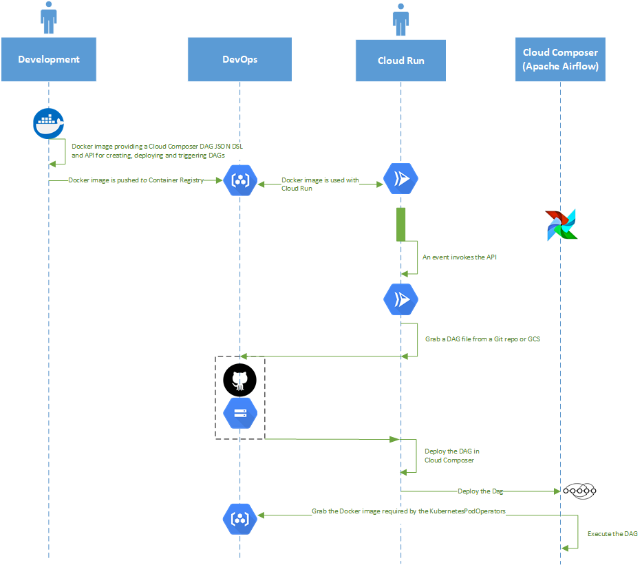

# Contents

* [Overview](#overview)
* [Architecture diagram](#architecture-diagram)
* [Getting started](#getting-started)
	* [Clone the repository](#clone-the-repository) 
	* [Installing the Python dependencies](#installing-the-python-dependencies) 
	* [Execute the unit tests](#execute-the-unit-tests)
	* [Build the Docker image](#build-the-docker-image)
	* [Push the Docker image to GCP Cloud Registry](#push-the-docker-image-to-gcp-cloud-registry)
* [JSON DAG DSL](#json-dag-dsl)
	* [Swagger-UI API documentation](#swagger-ui-api-documentation)
	* [Example usage](#example-usage)
* [GCP Environment Setup](#gcp-environment-setup)
	*  [GCP Environment test scripts](#gcp-environment-test-scripts)
* [Automation scripts for creation and deletion of GCP composer-api environment](#automation-scripts-for-creation-and-deletion-of-gcp-composer-api-environment)
    * [Docker install](#docker-install)
    * [Creation script](#creation-script)
    * [Deletion script](#deletion-script)

# Overview

`composer-dag-dsl` is a Google Cloud Platform project consisting of a Docker container which provides 3 ways of validating, deploying and triggering a DAG within the [Cloud Composer](https://cloud.google.com/composer) ([Apache Airflow](https://airflow.apache.org/)) service:

* DAG file in a Git repository
* DAG file stored in GCS (Google Cloud Storage)
* DAG file using the DAG JSON DSL

This project provides a JSON DAG DSL to define and describe a DAG that will be deployed to GCP Cloud Composer.

Let's start with a quick refresher of those terms:
* [JSON: JavaScript Object Notation](https://en.wikipedia.org/wiki/JSON): an open standard file format, and data interchange format, that uses human-readable text to store and transmit data objects consisting of attribute–value pairs and array data types (or any other serializable value).
* [DSG: Directed Acyclic Graph](https://en.wikipedia.org/wiki/Directed_acyclic_graph): a directed graph with no directed cycles. That is, it consists of vertices and edges (also called arcs), with each edge directed from one vertex to another, such that there is no way to start at any vertex v and follow a consistently-directed sequence of edges that eventually loops back to v again. GCP Cloud Composer, and the underlying Apache AIrflow technology, uses the concept of a DAG as its fundamental deployment unit.
* [DSL: Domain Specific Language](https://en.wikipedia.org/wiki/Domain-specific_language): is a computer language specialized to a particular application domain.

# Architecture diagram



# Getting started

Get started with the project by cloning the git repo, installing the python dependencies and executing the unit tets.

## Clone the repository

Assuming that your computer already has a Git installation, you can clone the repository with the following command.

`git clone https://github.com/damianmcdonald/composer-dag-dsl.git composer-dag-dsl`

## Installing the Python dependencies

Assuming that your computer already includes an installation of Python3 and Pip3, install the python dependencies with the following commands.

```bash
# navigate to the location where the respository was cloned
cd composer-dag-dsl

# install the python dependenices
python -m pip install -r requirements.txt
```

## Execute the unit tests

Execute the project's unit tests to ensure that the environment has been correctly configured.

```bash
# navigate to the location where the respository was cloned
cd composer-dag-dsl

# navigate to the unit tests directory
cd composer-test/unit

# in the file execute-tests.sh, update the PYTHONPATH variable to reflect the path to the root of the project on your computer
export PYTHONPATH=/path/to/composer-dag-dsl-project-root

# set the executable bit on the execute-tests.sh file
chmod +x execute-tests.sh

# execute the tests
./execute-tests.sh
```

## Build the Docker image

The project is deployed as a Docker image, as defined in the [Dockerfile](Dockerfile).

The Docker image can be built with the following commands.

```bash
# build the Docker image
docker build

# tag the Docker image using the hash that was created during the build phase and an appropriate version number
docker tag <SHA_HASH> composer-dag-dsl:1.0.0

# run the Docker image
# note that the Docker image requires some environment variables
# an example of an external environment variable file can be found in
# composer-test/container/env_composer
docker run -p 5000:5000 --env-file=${PWD}/composer-test/container/env_composer composer-dag-dsl:1.0.0
```

## Push the Docker image to GCP Cloud Registry

For the official Google documentation, see [pushing and pulling images from GCP Container Registry](https://cloud.google.com/container-registry/docs/pushing-and-pulling#:~:text=To%20push%20any%20local%20image,in%20your%20Google%20Cloud%20project).

The following steps can be performed to push the local Docker image to GCP Cloud Registry.

```bash
# configure your gcloud command with a user with permissions to push images to Cloud Registry
gcloud auth login user@gcp-account.com

# add GCP Cloud Registry as a Docker creds helper 
gcloud auth configure-docker "eu.gcr.io"

# build the Docker image
docker build

# tag the Docker image using the hash that was created during the build phase and an appropriate version number
docker tag <SHA_HASH> composer-dag-dsl:1.0.0

# push the tagged image from local registry to GCP Cloud Registry
docker push eu.gcr.io/<GCP_PROJECT_ID>/composer-dag-dsl:1.0.0
```

# JSON DAG DSL

This project uses a JSON DAG DSL to define and describe a DAG that will be deployed to GCP Cloud Composer.

Let's start with a quick refresher of those terms:
* [JSON: JavaScript Object Notation](https://en.wikipedia.org/wiki/JSON): an open standard file format, and data interchange format, that uses human-readable text to store and transmit data objects consisting of attribute–value pairs and array data types (or any other serializable value).
* [DSG: Directed Acyclic Graph](https://en.wikipedia.org/wiki/Directed_acyclic_graph): a directed graph with no directed cycles. That is, it consists of vertices and edges (also called arcs), with each edge directed from one vertex to another, such that there is no way to start at any vertex v and follow a consistently-directed sequence of edges that eventually loops back to v again. GCP Cloud Composer, and the underlying Apache AIrflow technology, uses the concept of a DAG as its fundamental deployment unit.
* [DSL: Domain Specific Language](https://en.wikipedia.org/wiki/Domain-specific_language): is a computer language specialized to a particular application domain.

With respect to this project, the JSON DAG DSL, allows a consumer to describe a DAG file using a pre-defined JSON syntax.

## Swagger-UI API documentation

For a complete overview of the entire JSON DAG DSL specification, please see the [Swagger-UI](https://swagger.io/tools/swagger-ui/) documentation which is available within the running application at:

https(s)://${HOSTNAME}:${PORT}/api/docs. 

For example; http://localhost:5000/api/docs.

## Example usage

Let's start with a minimal example of defining a DAG via the JSON DAG DSL.

```JSON
{
    "dag_name" : "minimal_dag_kubernetes_pod_operator",
    "mode": "INLINE",
    "kubernetes_pod_operators": [
        {
            "task_id" : "k8s_pod_operator_example_task_01",
            "name" : "k8s_pod_example_01",
            "image" : "bash"
        }
    ]   
}
```

In the above example, we define a *dag_name*, we specifiy the *mode* as `INLINE` and we define a simple *kubernetes_pod_operators* operator.

In addition to the [kubernetes_pod_operator](https://cloud.google.com/composer/docs/how-to/using/using-kubernetes-pod-operator), Cloud Composer also supports a [Bash Operator](https://cloud.google.com/composer/docs/how-to/using/writing-dags#bashoperator) and a [Python Operator](https://cloud.google.com/composer/docs/how-to/using/writing-dags#pythonoperator) .

Let's look at a minimal Bash Operator example.

```JSON
{
    "dag_name" : "minimal_dag_bash_operator",
    "mode": "INLINE",
    "bash_operators": [
        {
            "task_id" : "bash_operator_01",
            "command" : [
                "echo 'Hello from Airflow Bash Operator 01'"
            ]
        }
    ]
}
```

**NOTE**: Each element in the `command` array will be interpreted as a single, unique command to be executed.

Let's look at a minimal Python Operator example.

```JSON
{
    "dag_name" : "minimal_dag_python_operator",
    "mode": "INLINE",
    "python_operators": [
        {
            "task_id" : "python_operator_01",
            "function_def" : [
                "def python_operator_func_1():",
                "   print('Hello from Airflow Python Operator 01 -- DYNAMIC')"
            ],
            "function_name" : "python_operator_func_1"
        }
    ]
}
```

**NOTE**: Each element in the `function_def` array will be interpreted as a line of Python code. For this reason, you need to make sure that you respect the indentation within each line of code, as you can see in the example above.

Further examples.

| Example file  | Description  |
|---|---|
| [minimal_dag_kubernetes_pod_operator.json](composer-test/unit/dag/payloads/valid/minimal_dag_kubernetes_pod_operator.json)  | Minimal example with a Kubernetes pod operator |
| [minimal_dag_bash_operator.json](composer-test/unit/dag/payloads/valid/minimal_dag_ bash_operator.json)  | Minimal example of with a Bash operator |
| [minimal_dag_python_operator.json](composer-test/unit/dag/payloads/valid/minimal_dag_python_operator.json)  | Minimal example with a Python operator |
| [kubernetes_pod_operator_common.json](composer-test/unit/dag/payloads/valid/kubernetes_pod_operator_common.json)  | Example containing the most common options for use with a Kuberntes pod operator |
| [kubernetes_pod_operators_secrets.json](composer-test/unit/dag/payloads/valid/kubernetes_pod_operators_secrets.json)  | Example containing the a Kuberntes pod operator with Kubernetes secrets |
| [kubernetes_pod_operator_complete.json](composer-test/unit/dag/payloads/valid/kubernetes_pod_operator_complete.json)  | Example containing a complete Kuberntes pod operator configuration |
| [dag_optional_details.json](composer-test/unit/dag/payloads/valid/dag_optional_details.json)  | Example containing a optional details for a DAG |
| [dag_with_execution_sequence.json](composer-test/unit/dag/payloads/valid/dag_with_execution_sequence.json)  | Example containing a DAG with an operator execution sequence defined |
| [dag_complete.json](composer-test/unit/dag/payloads/valid/dag_complete.json)  | Complete DSL example containing all available options (when `mode==INLINE`) |

# GCP Environment Setup

A compatible GCP environment can be setup by following the high level steps detailed below.

* Access the GCP console
* Enable Composer API
* Create a Composer Environment
	* Image version: `composer-1.13.3-airflow-1.10.12`
	* Python version: `3`
	* Airflow configuration overrides

| Section  | Key  | Value  |
|---|---|---|
| api  | auth_backend | airflow.api.auth.backend.default |

* Create a Service Account
	* Role: Project -> Owner
	* Role: Service Accounts -> Service Account Token Creator
	* Role: Service Accounts -> Service Account User
	* Create key as JSON
	* Minify the service account JSON key data; https://jsonformatter.org/json-minify
	* Base64 encode the minified JSON; https://www.base64encode.org/
	* The Base64 encoded value will be later used in the `GOOGLE_APPLICATION_CREDENTIALS` environment variable
* Enable Cloud Run API (alternatively it can be enabled the first time you create a Cloud Run service)
* Create a Cloud Run service
	*  Select a region for the service (should be the same region as the Cloud Composer instance)
	*  Add a service name
	*  Select the path to the `composer-dag-dsl:X.X.X` Docker image
	*  In `Advanced Settings`, add the following `Variables`.

| Name  | Value (Example)  | Description  |
|---|---|---|
| PYTHONPATH  | /app | Source code location within the Docker image |
| LOG_LEVEL  | DEBUG | Log level of the application; DEBUG, INFO, WARNING, ERROR |
| GIT_PYTHON_GIT_EXECUTABLE  | /usr/bin/git | Absolute path to the Git binary within the Docker image |
| GUNICORN_PORT  | 80 | Http port number that the Docker image will respond on |
| GUNICORN_WORKERS  | 2 | Number of Gunicorn workers. More workers == more memory consumption |
| PROJECT_ID  | playground-s-11-48817e79 | Default GCP project to be used by the service |
| GCP_LOCATION  | europe-west3 | Default GCP location to be used by the service |
| COMPOSER_ENVIRONMENT  | composer | Name of the default Cloud Compser instance to be used by the service |
| GOOGLE_APPLICATION_CREDENTIALS  | eyJ0eXBlIjoic2VydmljZV9hY2Nv | The minified, base64 encoded value of the service account JSON key created in an earlier step |

* In Cloud Run -> `Advanced Settings`, add the following `Container` -> `General` settings.
	* `Container port`: this should match the `GUNICORN_PORT` defined in the environment variables.
	* `Service account`: select the service account created in an earlier step.
* In Cloud Run ->  `Advanced Settings`, add the following `Container` -> `Capacity` settings.
	* `Memory allocated`, increase the value to `512 MiB`.
* In Cloud Run, configure the service to be triggered via HTTP

## GCP Environment test scripts

The Cloud Composer and Cloud Run deployments can be tested via the scripts available in the [test-scripts](composer-test/container) folder.

Before executing the scripts, you must update the `REST_URL` variable within the [common.sh](composer-test/container/common.sh) script with the URL of the Cloud Run service deployment.

```bash
# define the api end point of the service to be tested
REST_URL=https://composer-service-wqi5tzidoa-ey.a.run.app/api/v1
```
The scripts should be tested in the following order:

| Order  | Script  | Description  |
|---|---|---|
| 01  | [test_api.sh](composer-test/container/test_api.sh) | Tests the /test method to confirm that the deployed service is working |
| 02  | [composer_config.sh](composer-test/container/composer_config.sh) | Tests the /composer/config method to retrieve details about the Cloud Composer environment |
| 03  | [composer_api.sh](composer-test/container/composer_api.sh) | Tests the /composer/api method to retrieve details about the Cloud Composer experimental REST API |
| 04  | [dag_validate.sh](composer-test/container/dag_validate.sh) | Tests the /dag/validate method to validate the provided dags payload using the JSON DSL |
| 05  | [dag_deploy.sh](composer-test/container/dag_deploy.sh) | Tests the /dag/deploy method which deploys a dag payload using the JSON DSL |
| 06  | [dag_list.sh](composer-test/container/dag_list.sh) | Tests the /dag/list method to list the dags deployed within the Cloud Composer environment |
| 07  | [dag_trigger.sh](composer-test/container/dag_trigger.sh) | Tests the /dag/trigger/{dag_name} method to trigger a specific dag which is already deployed within the Cloud Composer environment |

# Automation scripts for creation and deletion of GCP composer-api environment

Two demo scripts are available which automate the creation and deletion of the GCP composer-api environment.

**NOTE**: The GCE or CloudShell instance from which you run the creation script require a Docker installation. A helper script, [install_docker.sh](install_docker.sh), is provided to install Docker onto Ubuntu 18.04.

## Docker install

See [install_docker.sh](install_docker.sh).

```bash
#!/bin/bash

# install docker
echo -e "Installing Docker$."
sudo apt update -y
sudo apt install -y apt-transport-https ca-certificates curl software-properties-common
curl -fsSL https://download.docker.com/linux/ubuntu/gpg | sudo apt-key add -
sudo add-apt-repository "deb [arch=amd64] https://download.docker.com/linux/ubuntu bionic stable"
sudo apt update -y
sudo apt install -y docker-ce
sudo systemctl status docker
sudo usermod -aG docker ${USER}
sudo reboot
```

## Creation script

See [create_environment.sh](create_environment.sh).

```bash
#!/bin/bash

###################################################################
#Script Name    :create_environment.sh
#Description    :Script that creates Composer, Cloud Run, Container Registry enviroments
#Args           :
#Author         :Damian McDonald
#License        :GPL
#Version        :1.0.0
#Maintainer     :Damian McDonald
#Status         :Development
###################################################################

# define console colours
RED='\033[0;31m'
BLACK='\033[0;30m'
GREEN='\033[0;32m'
BROWN='\033[0;33m'
BLUE='\033[0;34m'
PURPLE='\033[0;35m'
CYAN='\033[0;36m'
YELLOW='\033[1;33m'
WHITE='\033[1;37m'
NC='\033[0m' # No Color

echo -e "${GREEN} ,-----.                                                          ,---.  ,------. ,--."
echo -e "${GREEN}'  .--./ ,---. ,--,--,--. ,---.  ,---.  ,---.  ,---. ,--.--.     /  O  \ |  .--. '|  |"
echo -e "${GREEN}|  |    | .-. ||        || .-. || .-. |(  .-' | .-. :|  .--'    |  .-.  ||  '--' ||  |"
echo -e "${GREEN}'  '--' ' '-' '|  |  |  || '-' '' '-' '.-'  ) |   --.|  |       |  | |  ||  | --' |  |"
echo -e "${GREEN} '-----' '---' '--'--'--'|  |-'  '---' '----'  '----''--'       '--' '--''--'     '--'"
echo -e "${GREEN}                         '--'                                                         "

echo -e "${NC}"

# define global variables
# set the project id manually: gcloud config set project ${GCP_PROJECT_ID}
GCP_PROJECT_ID=$(gcloud config get-value project 2> /dev/null)
GCP_LOCATION=europe-west1

# composer variables
COMPOSER_NAME=composer
COMPOSER_IMAGE_VER=composer-1.13.4-airflow-1.10.12
COMPOSER_AIRFLOW_CONFIGS=api-auth_backend=airflow.api.auth.backend.default

# container registry variables
GIT_SOURCE_URL=https://github.com/damianmcdonald/composer-dag-dsl.git
DOCKER_IMAGE=eu.gcr.io/<GCP_PROJECT_ID>/composer-dag-dsl:1.0.0

# cloud run variables
CLOUD_RUN_SERVICE_ACCOUNT_NAME=composer-api
CLOUD_RUN_SERVICE_ACCOUNT_ID=${CLOUD_RUN_SERVICE_ACCOUNT_NAME}@${GCP_PROJECT_ID}.iam.gserviceaccount.com
CLOUD_RUN_NAME=composer-api
CLOUD_RUN_MEMORY=512Mi
CLOUD_RUN_ENV_VARS=PYTHONPATH=/app,LOG_LEVEL=DEBUG,GIT_PYTHON_GIT_EXECUTABLE=/usr/bin/git,GUNICORN_PORT=80,GUNICORN_WORKERS=2,PROJECT_ID=${GCP_PROJECT_ID},GCP_LOCATION=${GCP_LOCATION},COMPOSER_ENVIRONMENT=${COMPOSER_NAME}

# enable the relevant apis
echo -e "Enabling the following APIs"

echo -e "Enabling: ${YELLOW}Cloud Composer API${NC}"
gcloud services enable composer.googleapis.com

echo -e "Enabling: ${YELLOW}Cloud Run API${NC}"
gcloud services enable run.googleapis.com

echo -e "Enabling: ${YELLOW}Container Registry API${NC}"
gcloud services enable containerregistry.googleapis.com

echo -e "Enabling: ${YELLOW}Cloud Build API${NC}"
gcloud services enable cloudbuild.googleapis.com

echo -e "${NC}"

# create the composer environment
# see https://cloud.google.com/sdk/gcloud/reference/composer/environments/create
echo -e "Creating a Cloud Composer environment with the following settings:"
echo -e "GCP Project Id: ${BLUE}${GCP_PROJECT_ID}${NC}"
echo -e "GCP Location: ${BLUE}${GCP_LOCATION}${NC}"
echo -e "Composer Name: ${BLUE}${COMPOSER_NAME}${NC}"
echo -e "Composer Image Version: ${BLUE}${COMPOSER_IMAGE_VER}${NC}"
echo -e "Additional Airflow Configs: ${BLUE}${COMPOSER_AIRFLOW_CONFIGS}${NC}"

echo -e "${NC}"

gcloud composer environments create ${COMPOSER_NAME} \
--location=${GCP_LOCATION} \
--python-version=3 \
--image-version=${COMPOSER_IMAGE_VER} \
--airflow-configs=${COMPOSER_AIRFLOW_CONFIGS} \
--async

echo -e "The Cloud Composer environment is now being created in the background."
echo -e "${YELLOW}COFFEE TIME!!!${NC}This can take up to 50 minutes."

echo -e "${NC}"

# download the source code, build docker image and push to container registry
echo -e "Grabbing the project source code."
if [ -d "composer-api-src" ]; then rm -rvf "composer-api-src"; fi
git clone ${GIT_SOURCE_URL} composer-api-src
cd composer-api-src

echo -e "${NC}"

# add GCP Cloud Registry as a Docker creds helper 
echo -e "Configure Docker to push to ${BLUE}eu.gcr.io${NC}."
gcloud auth configure-docker "eu.gcr.io"

# build and tag the Docker image
echo -e "Building and tagging the image."
docker build -t ${DOCKER_IMAGE} .

# push the tagged image from local registry to GCP Cloud Registry
echo -e "Pushing the image to Container Registry: ${YELLOW}${DOCKER_IMAGE}${NC}."
docker push ${DOCKER_IMAGE}

echo -e "${NC}"

cd ..

# create the service account to be used with Cloud Run
# see https://cloud.google.com/iam/docs/creating-managing-service-accounts
echo -e "Creating the service account for Cloud Run"
gcloud iam service-accounts create ${CLOUD_RUN_SERVICE_ACCOUNT_NAME} \
    --description="Used for connecting the Cloud Run composer api to Cloud Composer" \
    --display-name="Composer API Service Account"

# grant the roles on the service account
echo -e "Granting roles for the service account for ${CLOUD_RUN_SERVICE_ACCOUNT_ID}"
echo -e "Granting role: ${YELLOW}roles/iam.serviceAccountUser${NC}"
gcloud projects add-iam-policy-binding ${GCP_PROJECT_ID} \
    --member="serviceAccount:${CLOUD_RUN_SERVICE_ACCOUNT_ID}" \
    --role="roles/iam.serviceAccountUser"

echo -e "Granting role: ${YELLOW}roles/project.Owner${NC}"
gcloud projects add-iam-policy-binding ${GCP_PROJECT_ID} \
    --member="serviceAccount:${CLOUD_RUN_SERVICE_ACCOUNT_ID}" \
    --role="roles/owner"

echo -e "Granting role: ${YELLOW}roles/iam.serviceAccountTokenCreator${NC}"
gcloud projects add-iam-policy-binding ${GCP_PROJECT_ID} \
    --member="serviceAccount:${CLOUD_RUN_SERVICE_ACCOUNT_ID}" \
    --role="roles/iam.serviceAccountTokenCreator"

echo -e "Lisiting the service account roles:"
gcloud projects get-iam-policy ${GCP_PROJECT_ID}  \
--flatten="bindings[].members" \
--format='table(bindings.role)' \
--filter="bindings.members:${CLOUD_RUN_SERVICE_ACCOUNT_ID}"

echo -e "${NC}"

# deploy the cloud run container
# see https://cloud.google.com/sdk/gcloud/reference/run/deploy
echo -e "Deploying the cloud run container with the following details:"
echo -e "Cloud Run Service Name: ${YELLOW}${CLOUD_RUN_NAME}${NC}"
echo -e "Cloud Run Image Name: ${YELLOW}${DOCKER_IMAGE}${NC}"
echo -e "Cloud Run Memory Allocation: ${YELLOW}${CLOUD_RUN_MEMORY}${NC}"
gcloud run deploy ${CLOUD_RUN_NAME} \
--image=${DOCKER_IMAGE} --memory=${CLOUD_RUN_MEMORY} \
--service-account=${CLOUD_RUN_SERVICE_ACCOUNT_ID} \
--set-env-vars=${CLOUD_RUN_ENV_VARS} --port=80 \
--allow-unauthenticated --platform=managed --region=${GCP_LOCATION} --async

echo -e "${NC}"

echo -e "The Cloud Run environment is now being created in the background."

echo -e "${NC}"

echo -e "${GREEN}DEPLOYMENT PROCESS COMPLETE!!!${NC}"

echo -e "${NC}"

echo -e "Now you should navigate to the GCP Console and check the status of the Composer and Cloud Run deployments."
```

## Deletion script

See [delete_environment.sh](delete_environment.sh).

```bash
#!/bin/bash

###################################################################
#Script Name    :delete_environment.sh
#Description    :Script that deletes Composer, Cloud Run, Container Registry enviroments
#Args           :
#Author         :Damian McDonald
#License        :GPL
#Version        :1.0.0
#Maintainer     :Damian McDonald
#Status         :Development
###################################################################

# define console colours
RED='\033[0;31m'
BLACK='\033[0;30m'
GREEN='\033[0;32m'
BROWN='\033[0;33m'
BLUE='\033[0;34m'
PURPLE='\033[0;35m'
CYAN='\033[0;36m'
YELLOW='\033[1;33m'
WHITE='\033[1;37m'
NC='\033[0m' # No Color

# define global variables
# set the project id manually: gcloud config set project ${GCP_PROJECT_ID}
GCP_PROJECT_ID=$(gcloud config get-value project 2> /dev/null)
GCP_LOCATION=europe-west1

# composer environment to delete
COMPOSER_NAME=composer

# cloud run and service account to delete
CLOUD_RUN_SERVICE_ACCOUNT_NAME=composer-api
CLOUD_RUN_SERVICE_ACCOUNT_ID=${CLOUD_RUN_SERVICE_ACCOUNT_NAME}@${GCP_PROJECT_ID}.iam.gserviceaccount.com
CLOUD_RUN_NAME=composer-api

# container registry image to delete
DOCKER_IMAGE=eu.gcr.io/<GCP_PROJECT_ID>/composer-dag-dsl:1.0.0

# delete the local git repo
echo -e "Deleting the local source repository: ${RED}composer-api-src${NC}"
if [ -d "composer-api-src" ]; then rm -rvf "composer-api-src"; fi

echo -e "${NC}"

# delete the composer environment
echo -e "Deleting the Cloud Composer environment: ${RED}${COMPOSER_NAME}${NC}"
gcloud composer environments delete ${COMPOSER_NAME} --location ${GCP_LOCATION}

echo -e "${NC}"

# delete the cloud run service
echo -e "Deleting the Cloud Run environment: ${RED}${CLOUD_RUN_NAME}${NC}"
gcloud beta run services delete ${CLOUD_RUN_NAME} --platform managed --region ${GCP_LOCATION}

echo -e "${NC}"

# delete the container registry image
echo -e "Deleting the Container Registry image: ${RED}${DOCKER_IMAGE}${NC}"
gcloud container images delete ${DOCKER_IMAGE} --force-delete-tags

# delete the service account
echo -e "Deleting the service account: ${CLOUD_RUN_SERVICE_ACCOUNT_ID}"
gcloud iam service-accounts delete ${CLOUD_RUN_SERVICE_ACCOUNT_ID}

echo -e "${NC}"

echo -e "${GREEN}CLEANUP PROCESS COMPLETE!!!${NC}"

echo -e "${NC}"

echo -e "If the commands above executed without errors then the resources have been cleaned up."
```